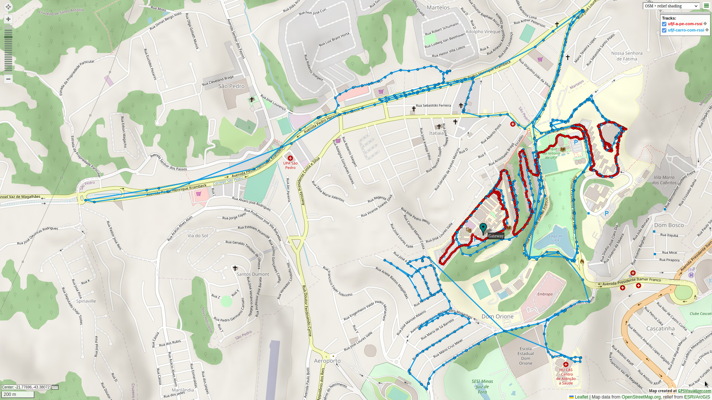

# LoRa-RSSI-dataset-outdoor

This repository contains the CSV files with RSSI measurements obtained in a LoRaWAN network. This data belongs to the dataset created during the development of my monograph.

The data contained here was created using the [LoRa RSSI Grabber](https://github.com/oliveiraleo/LoRa-RSSI-Grabber) program and was used as input on [RSSignal](https://github.com/oliveiraleo/RSSignal-LoRa) framework.

## File description

All file names begin with the timestamp (local time) taken on the start of the measurement collection. Each CSV file contains a header with descriptive naming labels.

The suffixes mean the following:

* `LoRa-Device-GPS-RSSI-data`: Data collected by the LoRa device and the GPS device. The time is local time; GPS reported timestamps are in GMT-0 time zone; GPS position is in decimal degrees; Other GPS data; and device's measured RSSI.
* `GW-MQTT-API-data`: RAW data received by the MQTT API (JSON-like format).
* `LoRa-RSSI-GW-decoded`: As the API gave the ID in base64 format, it was necessary to decode it. Packet id; and gateway RSSI measurement.
* `RSSI-data`: Gateway and device's RSSI data only, ready to be reused later on. NOTE: The measurements were synced, so the first packet is on the top and so on.
* `Full-Collected-data`: All the collected data joined in a single file, easier to analyze everything at the same time, or crop the file if needed. The id was used to sync the packets in order and discard the ones lost during the survey process.

Each folder name briefly describes the environment where survey occurred. ‘LOS’ and ‘NLOS’ mean, respectively, “Line of Sight” and “Non Line of Sight”.

For additional information, please refer to the [LoRa RSSI Grabber](https://github.com/oliveiraleo/LoRa-RSSI-Grabber) repository.

## Campus test environment

There's a preview of the GPS data below:

You can find an interactive map containing the RSSI measurements and precise gateway location inside the [map-data](./map-data/) folder

## Citing this work

If you used any of the data available here, please, cite it as:

[TODO] Waiting for the work to be released to update here

### Latex citation

[TODO] Waiting for the work to be released to update here

## Acknowledgements

The authors would like to thank Mr. Rogerio Casagrande and Mr. Thiago Scher, members of the LTA (Laboratorio de Telecomunicacoes Aplicadas) laboratory from the Engineering Faculty of the [Federal University of Juiz de Fora](https://ufjf.br), for assisting the configuration process and lending the LoRa equipment used to carry out the surveys that generated the data for this repository

We would like to acknowledge Mr. Adam Schneider for making available (free of charge) his  website [GPS visualizer](https://www.gpsvisualizer.com/), which was used to create the maps contained in this repository

## License

 This work is licensed under a <a rel="license" href="http://creativecommons.org/licenses/by-nc-sa/4.0/">Creative Commons Attribution-NonCommercial-ShareAlike 4.0 International License</a>.
